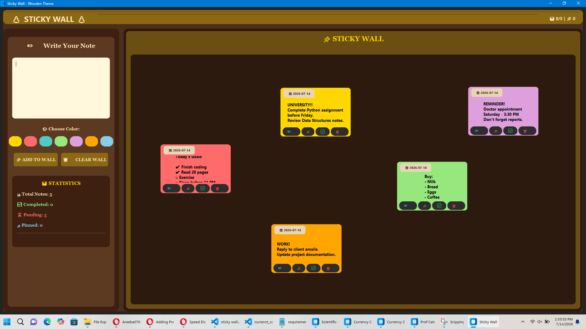
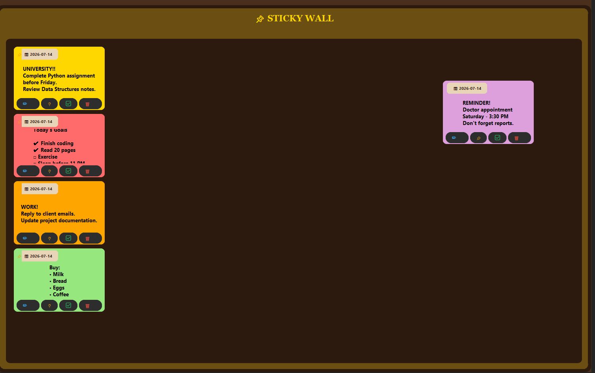
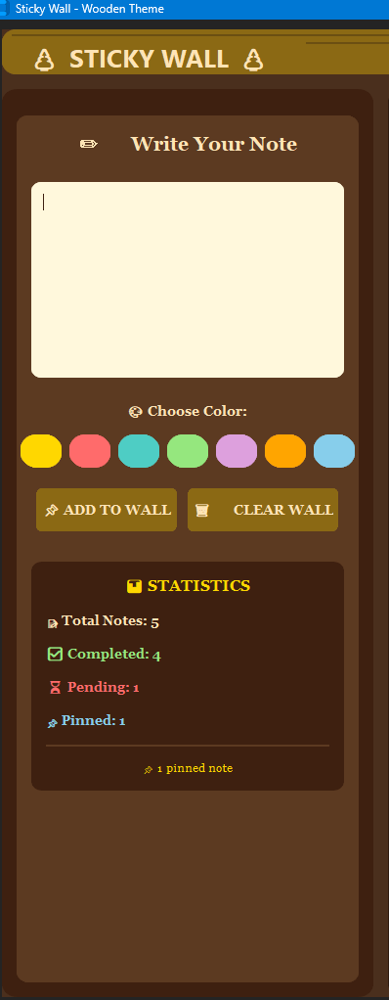

\# Sticky Wall


A modern GUI-based Sticky Notes application built with Python using CustomTkinter. It allows users to quickly create, edit, organize, pin, and manage digital sticky notes through a clean and user-friendly interface.


\## Features


\- Create unlimited sticky notes

\- Edit existing notes

\- Pin important notes

\- Mark notes as completed

\- Delete unwanted notes

\- Search notes instantly

\- Note statistics

\- Modern CustomTkinter interface

\- Light and Dark themes

\- Simple and intuitive design


\## Technologies Used


\- Python

\- CustomTkinter

\- Tkinter

\- JSON

\- Datetime module


\## Installation


\### 1. Clone the repository


```bash

git clone https://github.com/YOUR\_USERNAME/sticky-wall-python.git

```


\### 2. Open the project folder


```bash

cd sticky-wall-python

```


\### 3. Install dependencies


```bash

pip install -r requirements.txt

```


\### 4. Run the application


```bash

python StickyWall.py

```


## Project Screenshots

### Home Page



### Pin Notes



### Edit Notes


### Complete Notes


### Statistics



\## Future Improvements


\- Add note categories

\- Add reminders and notifications

\- Cloud synchronization

\- Password protection

\- Rich text formatting

\- Export and import notes


\## Learning Note


This project was created as part of my Python learning journey. I used AI as a learning and debugging assistant while building and understanding the application.


\## Author


\*\*Areeba\*\*

